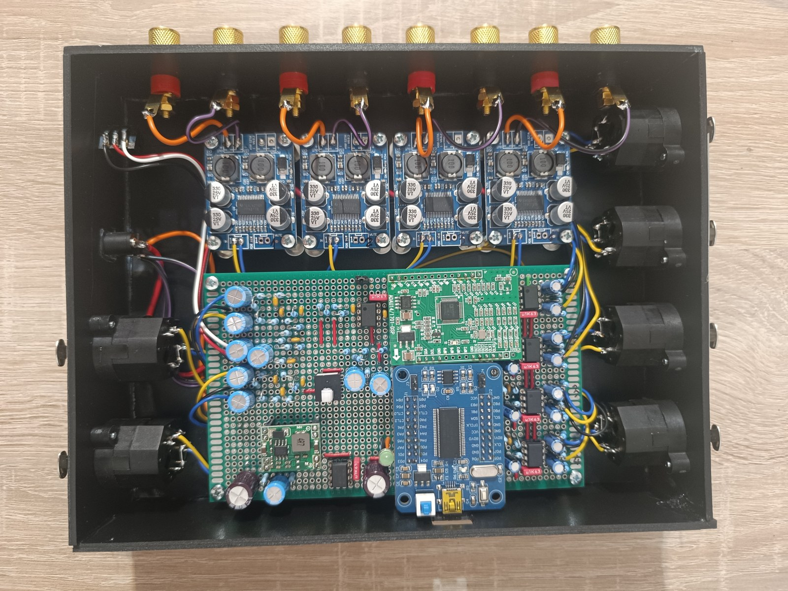
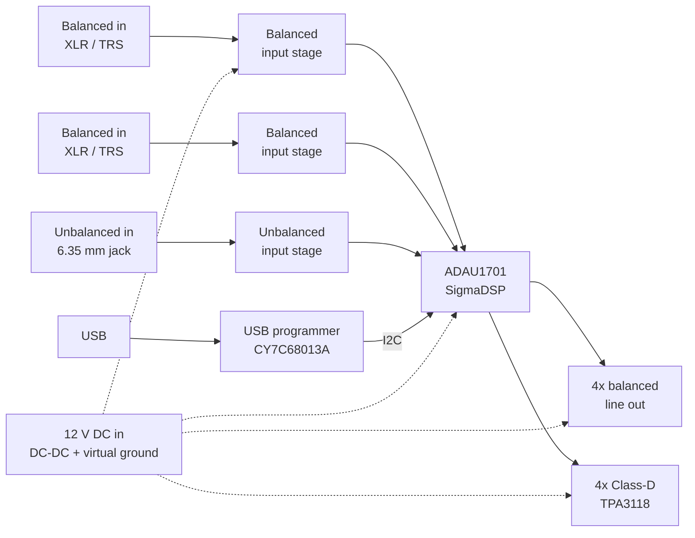
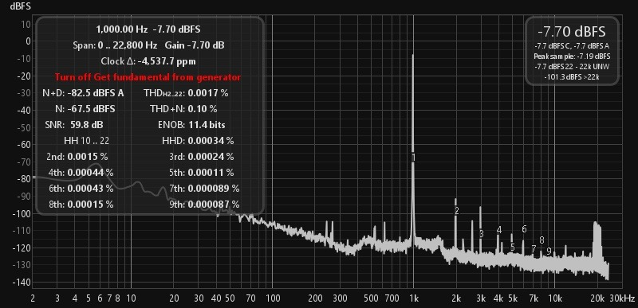
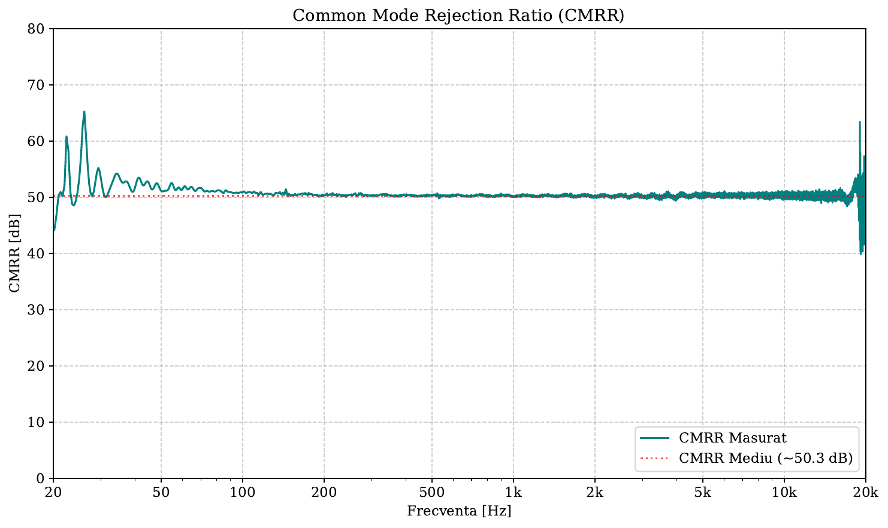

# DSPAmp

A multichannel audio amplifier with a real-time programmable DSP: balanced and unbalanced line
inputs with switchable gain, an ADAU1701 SigmaDSP, four balanced line outputs and four Class-D
power outputs, all running from a single 12 V supply. Designed, simulated, built and measured as my
MSc dissertation.

> **Graded 10/10 and awarded the best dissertation in the history of the MSc programme.**
> Full thesis (Romanian): [`thesis/DSPAmp_Dissertation_RO.pdf`](thesis/DSPAmp_Dissertation_RO.pdf)

<p align="center">
  
</p>

## Architecture



| Block | Implementation |
|---|---|
| **Input stage** | Balanced and unbalanced line inputs, switched-gain preamp scaling both **+4 dBu** (pro) and **−10 dBV** (consumer) levels to ≈1 V<sub>rms</sub> for the DSP's ADC. OPA2134 op-amps |
| **DSP** | ADAU1701 (SigmaDSP, 48 kHz), programmed live from SigmaStudio |
| **Programmer** | USB-to-I2C programmer based on [freeUSBi](https://github.com/freeDSP/freeUSBi) (CY7C68013A), with 2N7000 I2C bus isolation; can write the DSP program to EEPROM for standalone use |
| **Line outputs** | Four impedance-balanced line outputs (XLR / TRS) |
| **Power outputs** | Four TPA3118 Class-D modules, one per DSP output |
| **Power** | Single 12 V DC input; DC-DC converter for the 5 V rail and a TL072 virtual ground so the op-amp stages run single-rail |

## Measured results

Measured in loopback with an external audio interface and Room EQ Wizard; DSP controlled live from SigmaStudio.

| Parameter | Result |
|---|---|
| THD (1 kHz, balanced input) | **0.0017 %** |
| SNR (1 kHz) | **59.8 dB** balanced · 50.4 dB unbalanced |
| CMRR (100 Hz – 10 kHz, average) | **≈50.3 dB**, limited by the 1 % resistors in the differential network |
| Frequency response, DSP bypassed | 20 Hz – 20 kHz within ±1.5 dB |
| Gain accuracy, unbalanced input | 0.3 % (high gain) and 2.4 % (low gain) from the calculated values |

<p align="center">
  
  
</p>

All stages were first simulated in LTspice (frequency response, input/output impedance, transient
behaviour, CMRR sensitivity to resistor tolerance), then built and measured on perfboard.

## Repository structure

```
hardware/       KiCad 9 schematic, schematic PDF, BOM with Mouser part numbers
simulations/    LTspice schematics (input stage, output stage, virtual ground) + exported results
measurements/   REW captures: THD, SNR, CMRR, frequency response with and without DSP effects
scripts/        Python scripts that turn the simulation and measurement data into the thesis plots
thesis/         LaTeX source of the dissertation + the final PDF (Romanian)
docs/notes/     Design notes on the line input stage and the ADAU1701 ADC
```

## Reproducing

**Plots:** `pip install numpy matplotlib pandas`, then run any script from `scripts/`. Each one reads
from `simulations/` or `measurements/` and writes its figure into `thesis/figuri/`.

**Thesis PDF:** built with `latexmk -pdf main.tex` inside `thesis/` (any full TeX Live / MiKTeX
install).

**Hardware:** open `hardware/DSPAmp.kicad_pro` in KiCad 9. The DSP program is made in
[SigmaStudio](https://www.analog.com/en/resources/evaluation-hardware-and-software/software/ss_sigst_02.html).

## References

- D. Self, *Small Signal Audio Design*, Focal Press: the input and output stage design follows its line-input and line-output chapters
- [ADAU1701 datasheet](https://www.analog.com/en/products/adau1701.html), Analog Devices
- [freeUSBi](https://github.com/freeDSP/freeUSBi): the open-source SigmaDSP programmer this design's programmer is based on

## License

See [LICENSE.md](LICENSE.md): hardware and documentation under CC BY-SA 4.0, scripts under MIT.
